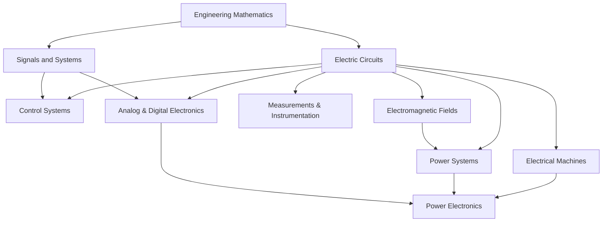

# Electrical Engineering Concept Prerequisite Map

This map outlines the core concepts in Electrical Engineering and their logical dependencies.

```mermaid
graph TD
    %% Foundation
    Math[Engineering Mathematics] --> Circuits[Electric Circuits]
    Math --> Signals[Signals and Systems]
    
    %% Core
    Circuits --> Machines[Electrical Machines]
    Circuits --> PowerSystems[Power Systems]
    Circuits --> Control[Control Systems]
    Circuits --> Electronics[Analog & Digital Electronics]
    Circuits --> Measurements[Measurements & Instrumentation]
    
    Signals --> Control
    Signals --> Electronics
    
    %% Advanced
    Machines --> PowerElectronics[Power Electronics]
    PowerSystems --> PowerElectronics
    Electronics --> PowerElectronics
    
    %% Specialized
    Circuits --> EMF[Electromagnetic Fields]
    EMF --> PowerSystems
```
