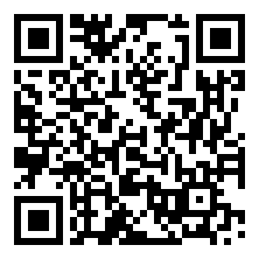

# Poster for your library, college or reading room

Print this page on A4 and put it up where aspirants study: a self-study library, a reading room, a college notice
board, a Common Service Centre. Ask the owner or the institution first. One poster can reach hundreds of students
who will never find this list through a search.

To print, open the menu in your browser and choose **Print** (on a phone: **Share → Print**). You can also save it
as a PDF and send it on WhatsApp.

## मुफ़्त परीक्षा तैयारी · Free exam preparation

**GATE · ESE · UPSC · SSC · Railway · Bank · JEE · NEET · CUET · CLAT · State PSC · Teaching**

118 परीक्षाएँ · आधिकारिक स्रोत · पिछले साल के प्रश्नपत्र · मुफ़्त कोचिंग योजनाएँ · इंटरनेट के बिना भी

118 exams · Official sources · Previous papers · Free coaching schemes · Works offline

**स्कैन करें · Scan** → lakhidas168-ship-it.github.io/awesome-indian-exams

**कोई फ़ीस नहीं · कोई लॉगिन नहीं · कोई विज्ञापन नहीं**
No fees · No login · No ads

